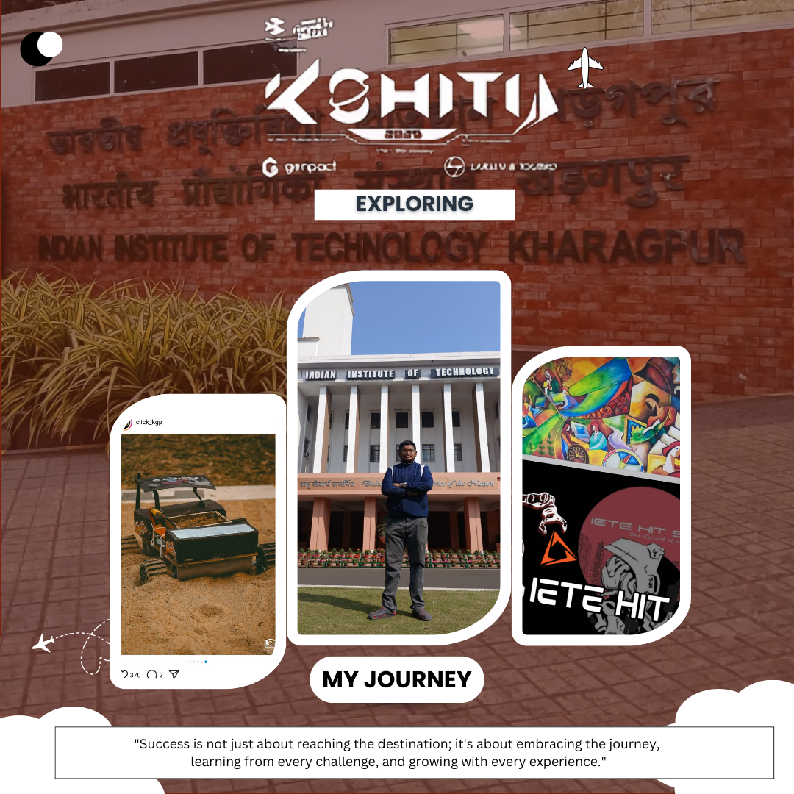
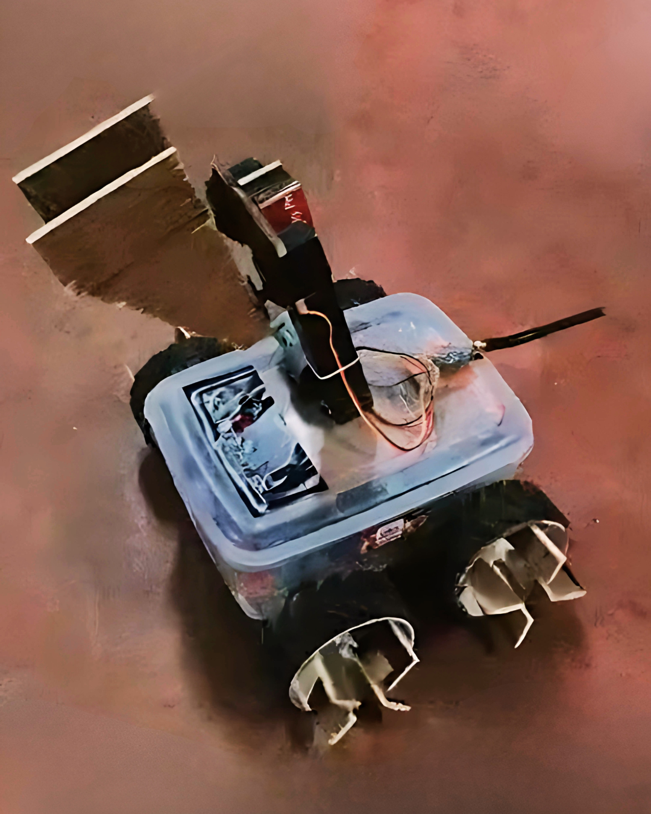

# 🤖 KSHITIJ 2025 BOTS

  
  
  
  
  

---

## 🏆 Achievements

- ✅ Participated in **KSHITIJ 2025 at IIT Kharagpur**
- ✅ Showcased two robots: **Sand Rover** & **Droid Blitz**
- ✅ Designed in-house with custom controllers and wireless modules

---

## ⚙️ Projects Overview

### 1️⃣ **Sand Rover – Rugged Load Transporter for Uneven Terrain**

A compact, semi-autonomous robot tailored for difficult terrain. It uses high-torque motors, Bluetooth control, and a durable frame, making it ideal for agriculture, disaster zones, and construction sites.

#### 🔩 Key Features:
- 🛞 Compact: 26.2 cm × 20.6 cm frame
- 🔋 Powered by 2200mAh LiPo/Li-ion battery
- 🎮 Controlled via Bluetooth & NRF24L01 module
- 🚜 4× Johnson 300 RPM motors for high grip and torque
- 🧠 Controlled using Arduino Uno and Nano over UART
- 💸 Built for under ₹6400 with off-the-shelf components

#### 📸 Images:

  

---

### 2️⃣ **Droid Blitz – Amphibious Robot for Land & Water Operations**

Designed for the "Droid Blitz" event, this robot is engineered for seamless navigation across both land and water. Capable of performing multi-terrain tasks like block placement and package transfer, it is a testament to robotics versatility.

#### 🌊 Core Capabilities:
- 🏞 Amphibious Navigation: Operates in water and land zones
- 📦 Performs tasks like block bridging, object placement, and obstacle negotiation
- 🎮 Custom-built wireless controller with joysticks and buttons
- 🧠 Dual MCU system with Arduino Uno & Nano
- 🚗 Motors: Johnson 300 RPM & 10 RPM pick-and-place units
- 🔧 Enhanced with servo motors and water-resistant design

#### 📸 Images:

  

---

## 🧰 Shared Components

| Component                 | Sand Rover  | Droid Blitz |
|--------------------------|-------------|-------------|
| Arduino Uno              | ✅          | ✅          |
| Arduino Nano             | ✅          | ✅          |
| NRF24L01 PA+LNA          | ✅          | ✅          |
| BTS7960 Motor Driver     | ✅ (x2)     | ✅ (x2)     |
| Johnson Motor (300 RPM)  | ✅ (x4)     | ✅ (x4)     |
| Servo Motor              | ❌          | ✅ (x2)     |
| Joysticks                | ✅ (x2)     | ✅ (x2)     |
| Push Buttons             | ✅ (x5)     | ✅ (x5)     |
| Battery (LiPo/Li-ion)    | ✅          | ✅          |

---

## 💡 Real-World Applications

- **Sand Rover**
  - Agricultural transport of crops and equipment
  - Rough terrain delivery and disaster aid
  - Industrial material handling on uneven surfaces

- **Droid Blitz**
  - Amphibious rescue missions
  - Logistics across complex terrains
  - Industrial & defense robotic automation

---

## 🚀 Future Enhancements

- 🔧 **Sand Rover**
  - PID-based speed control
  - Sensor-based navigation and obstacle avoidance
  - Solar panel integration for extended field operations

- 🌊 **Droid Blitz**
  - Autonomous terrain detection
  - FPV camera for remote vision
  - AI-based task execution modules

---

## 📜 License

This project is licensed under the **MIT License**.  
See the [LICENSE](LICENSE) file for more details.

---

## 🔧 Developed By

**Arijit Dutta**  
📅 **Last Updated:** March 21, 2025

  

